# RAPID Masternode Setup

	A RAPID guide for setting up and hosting a masternode on a VPS (virtual private server)
	Version 1.0.0 - 2018-04-01

----------------------------------------------------

## How to setup a Virtual Private Server (VPS) and run a RAPID masternode.

For starters, the reason for running a dedicated VPS instead of hosting one’s masternode on a home internet connection are several. The masternode must be up and running all the time to provide services for the network. Should the connection go down, or the node performs badly, the rest of the network will be unhappy with the services and the masternode loses payments. Many home internet providers are unhappy if the owner runs a server at home and may shut down access to the masternode.

A typical masternode uses around 500 GB or more of traffic per month. Home internet users with traffic caps will have a hard time running a masternode if the bandwidth is limited. It is especially important to have a high speed connection as the masternode is serving up the blockchain. Additional features to the network will likely require a high speed connection as well.

### VPS requirements for a masternode
The minimal requirements for running a masternode are:

	* 1 GB of ram
	* 1 CPU core
	* 20 GB of hard drive space
	* a high speed internet connection and at least a transfer of 500 GB per month.

Better hardware can be used to help the masternode performance, but using less than the required minimal hardware can make the masternode unstable and cause the node to crash or perform poorly. By doing so, the node can get kicked off the masternode lists, causing the masternode to lose payments.

Users who are looking at building the hot wallet from source, please consider getting a VPS with `2 GB` of ram, or setup a swap file to allow the building to be successful. Using 1 GB of ram will likely cause memory errors and crashes during compiling.

### Setting up a local wallet for cold storage and a hot wallet (masternode) on a VPS

Let's start by getting the wallet for your platform.
Please go the website: https://github.com/rapidpayc/rapid/releases/latest and select the wallet that matches your computer. For this tutorial we will be using a 64-bit Windows machine for the cold storage wallet and a Ubuntu Linux VPS for the hot masternode daemon.

#### Install wallet on local machine
Download the Windows client, rapid-win64-xxx.zip 

#### Install the client, and then start it.
You may be prompted by the Windows Firewall to allow the wallet to accept connections on private and open networks. Please select both network boxes and accept. Now, with the client open, let it sync to the network wait for the blockchain to be downloaded. The wallet will attempt to synchronize with the network, no manual actions should be needed at this point.

<a href="Images/01.png">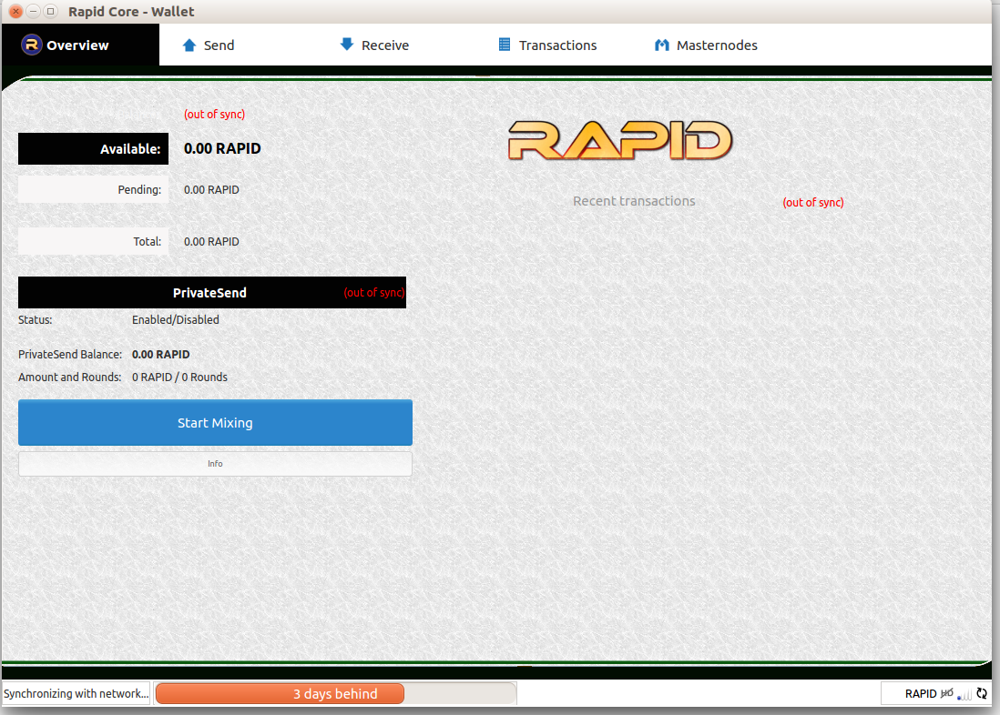</a>

#### Protect your funds with a strong password.
In your wallet, go to `Settings` and then `Encrypt Wallet`
Provide a strong password to secure your funds. Please make sure to remember this password or write it down and keep it in a bank safe deposit. If you lose your wallet password, there is no means of recovering your funds!
After providing a strong password, the wallet needs to be restarted to lock and encrypt your funds. Please restart your wallet for this step to complete.

<a href="Images/02.png">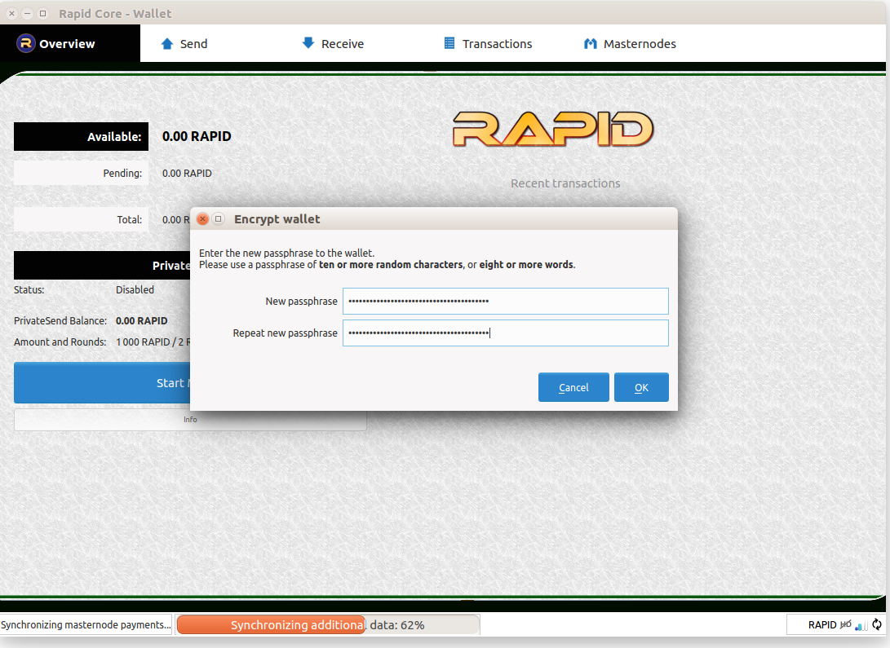</a>
<a href="Images/03.png">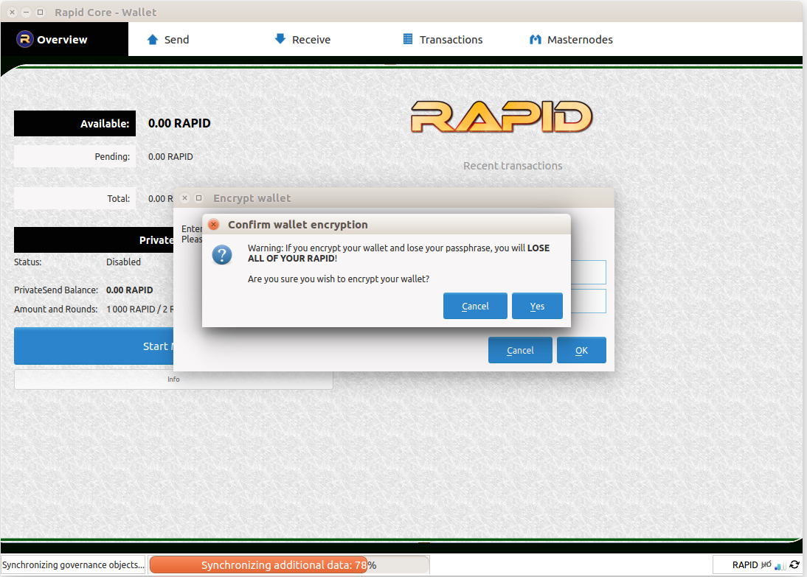</a>

We need to activate a few advanced wallet features before proceeding.
Click on `Settings` and `Options` and select the two top boxes

	"Enable coin control features" and "Show Masternodes Tab"

Click `OK` and we are ready to continue.

<a href="Images/05.png">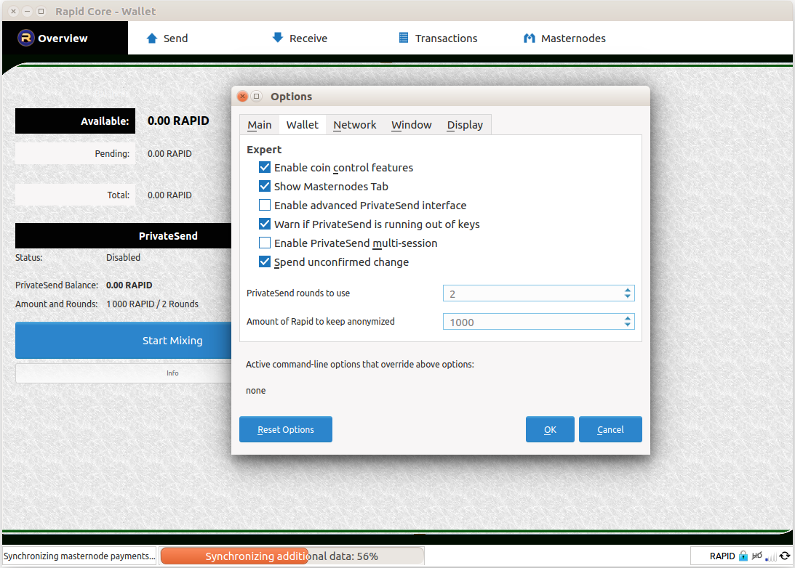</a>

With the wallet back up and running, it's time to get it ready for the masternode address.

Open the console by clicking the `Tools` menu and selecting `Debug console`
The next command provides us with a key for the masternode collateral. Please type

	masternode genkey

and hit enter. The output will look something like this:

	7ryov3YdixSPUVxTBJ5oe2qi88AJHXqHbYtMdph2Mizv3XTUiPd

<a href="Images/06.png">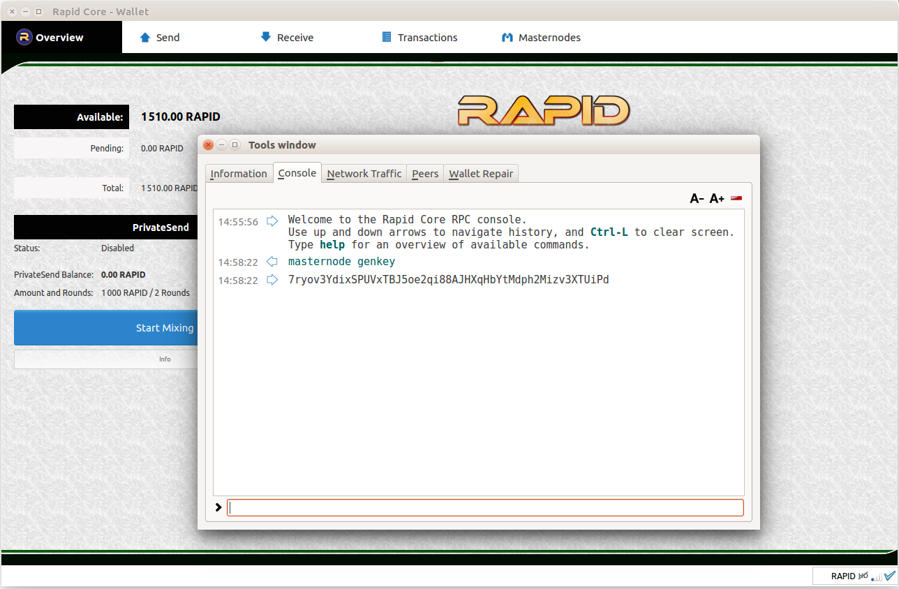</a>

Note: this is not the same as a RAPID address private key. This key is used to communicate to the RAPID network that this is a masternode, it cannot be used to move the collateral funds. The key is used to announce the presence of the masternode to the network, or remove the node from the masternode list.

Next, we need to make a transaction of exactly 1000 RAPID to an address. This is very important, the transaction must be exactly 1000 RAPID for the collateral, no more and no less.
Go to the `Receive` tab of your wallet and in the Label field write `Masternode Collateral` and keep the two checkboxes `Reuse an existing receiving address` and `Request InstantSend` unchecked. Click the orange button `Request payment` to get a new address:

	RYfiWGp7JKHH19FZQdBdH59PcXW3NCbyPH

This is the address we will be sending our collateral to.

<a href="Images/07.png">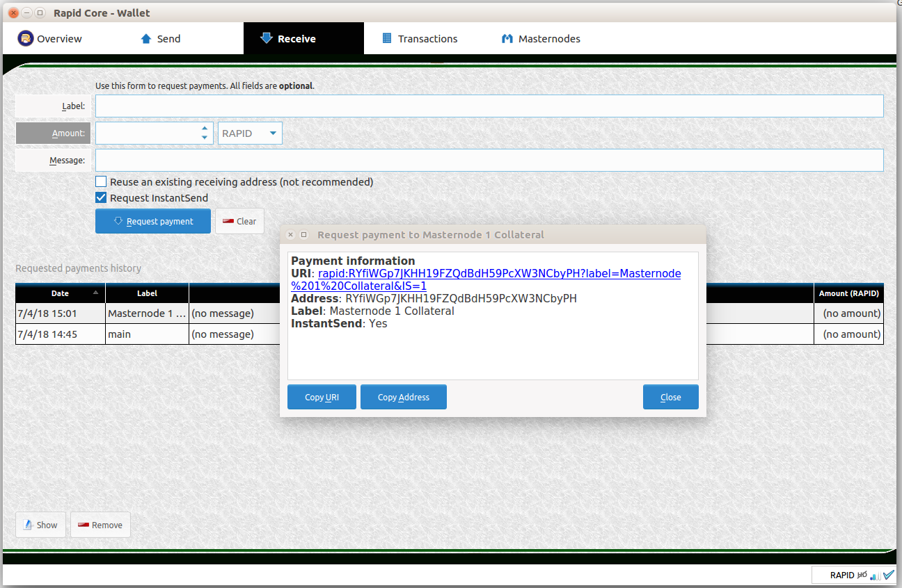</a>

Next, make a transaction of exactly `1000` RAPID to the address you just generated. If you are sending from you own wallet or from an exchange, make sure that any transaction fees are not taken from the sending amount. It is crucial that the collateral transaction is exactly `1000` RAPID and made in one (1) single transaction.

Go to the `Send` tab of your wallet and paste in the RAPID address to receive the collateral funds.
Uncheck the box with `Subtract fee from amount` and ensure that the sending amount is exactly `1000` RAPID.

Please triple check that the address is correct, and that the sending amount is `1000` RAPID. If you by mistake send your funds to the wrong address, *THEY WILL BE GONE!*

<a href="Images/08.png">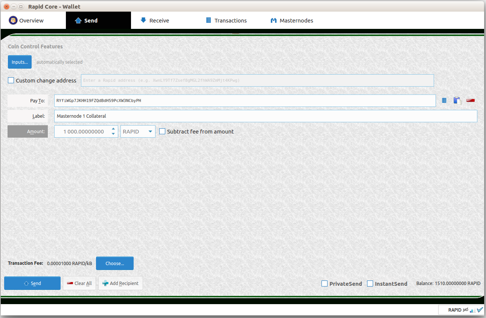</a>
<a href="Images/09.png">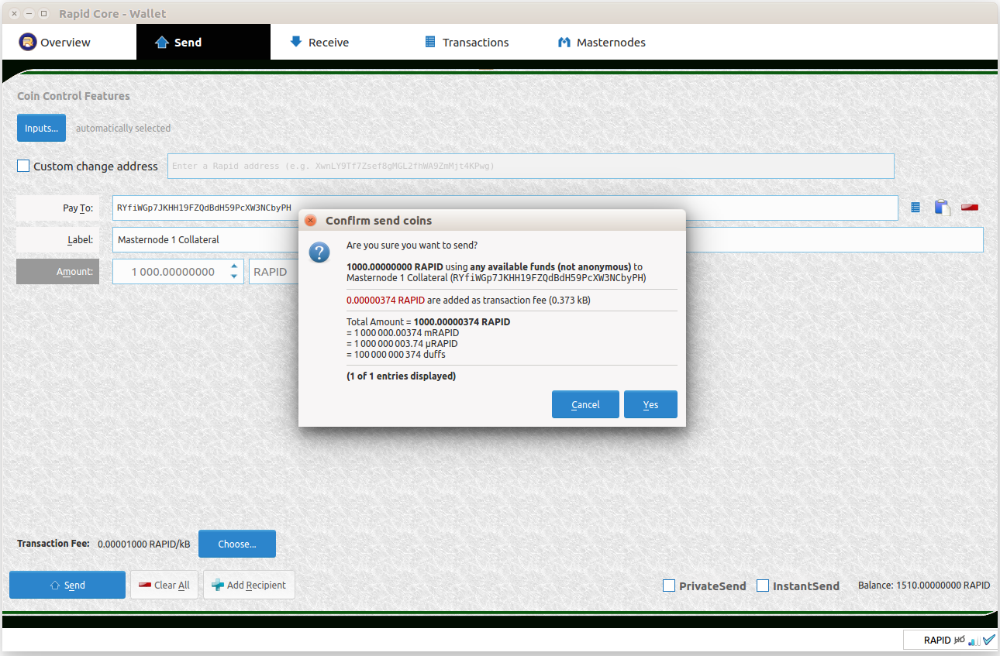</a>
<a href="Images/10.png">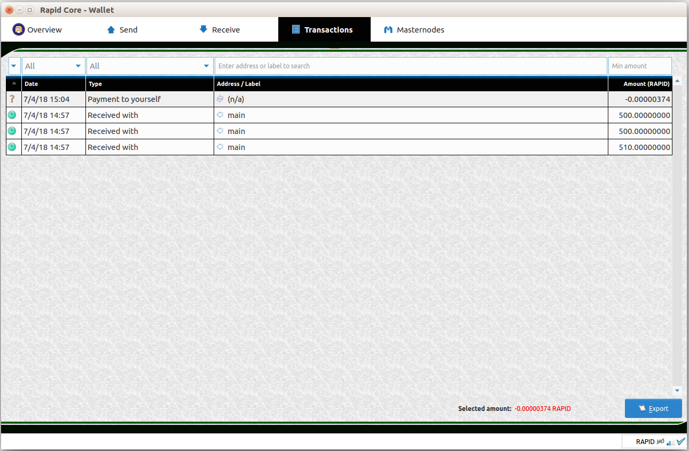</a>

After checking everything, send your funds to the address above and wait for the transaction to confirm. Press `send` and write your wallet password to make the transaction.
Check the `Transactions` tab, and there should be a transaction listed as `Payment to yourself` if you sent the funds from the wallet. Otherwise sending from an exchange will list that transaction address instead.

To avoid spending these funds we can `lock` the transaction in the wallet. This is done with the the coin control features of the wallet. Go back to the `Send` tab of the wallet and click on the `Inputs...` botton.
Select the box(es) with the `1000` RAPID transfer(s). Right click and chose `Lock unspent`. Notice that a small lock icon is shown next to the tranaction. This prevents the coins in this transaction from being spent the next time a transaction is made from the wallet. This is good, because if funds are taken from the holding address, it breaks the transaction for the masternode collateral and the masternode stops working - even if we have more than `1000` RAPID in our cold storage wallet! Should you want to send these funds again, simply right click on the transaction and select `Unlock unspent`.

<a href="Images/11.png">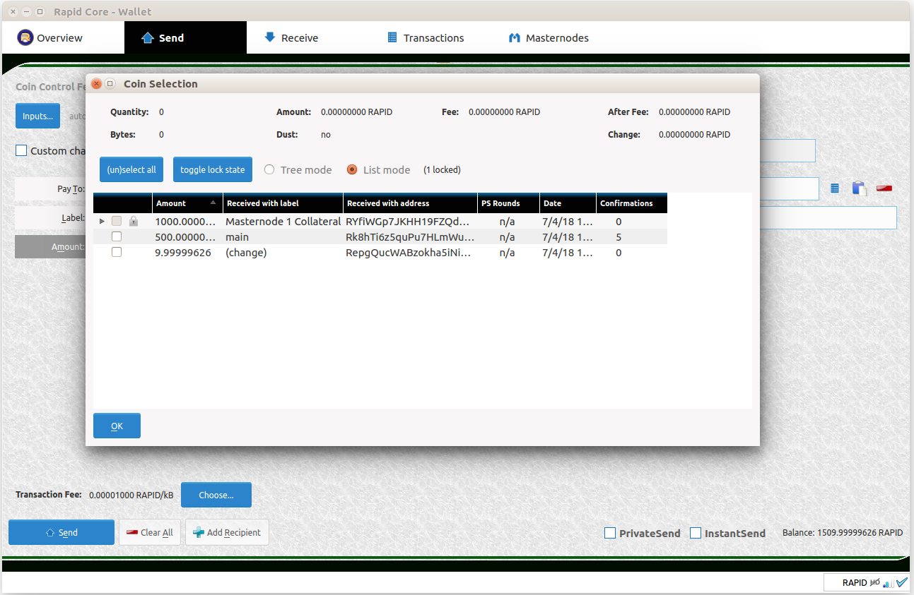</a>

#### While waiting, let's start working on the VPS (Virtual Private Server) hot node.
This guide will use Digital Ocean as a VPS provider, but the reader is free to chose whomever they like. The author has used them for years as a masternode host and they are very reliable. There are defiantly cheaper providers, but something to consider is that the masternode needs to be up and running 24/7 for supporting the network. Running a masternode on a cheaper, less reliable host will likely give more downtime and less payments in the longer run.

This <a href="https://m.do.co/c/ecdeeb807414">promotion & referral code</a> gives every new user a `$10` value to start using a new VPS. Please feel free to use it if you like.
Sign up for a new account, log in and click `New Droplet`
For this guide we are looking to start a `16.04 Ubuntu` version of Linux as the host:
Select the `1 GB / 1 CPU, 30 GB SSD Disk, 2 TB Transfer` version. The $10 USD credit provided via the promotional code will give most of the first month hosting for free! Chose a location, it doesn't really matter, but it might be better to chose a location closer to yourself for the remote management.

If you would rather like to build the VPS hot node daemon from source instead, consider getting a VPS that has 2GB of ram.

-----------------------------------------------------------

<a href="Images/17-ubuntu-1604-10usd-droplet.PNG">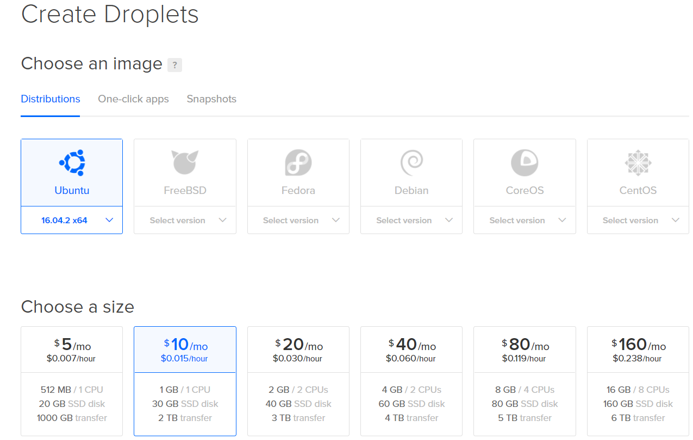</a>

Create the droplet, and the `root` login, `ip` and `password` will be sent to your email address. These details are needed to access your VPS instance.

To access a Linux VPS, you need a program called Putty, `http://www.putty.org/` it is a client to securely connect remotely to the VPS host.

Install the client and open putty.exe, if needed allow it through the Windows firewall and access your new droplet.
Provide the ip-number, keep the port on 22, and save the configuration with a suitable name. This allows for easier access next time you want to log on your droplet.
Click connect and a block window will open up, prompting you for your login and password. `root` is the login and the password is in your email from Digital Ocean.

<a href="Images/18-putty-droplet-configuration.PNG">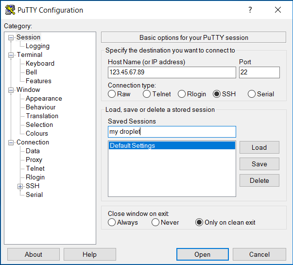</a>

Once logged in, it is smart to change the root password to something more secure. Remember that the email with the root password was sent in plain text, better change that and secure your VPS!
Type the command:

	passwd

and then provide a new password twice to change the password for user root.

We need a new common user to run the masternode. Running as root is in itself a security risk and is not encouraged. Here we are adding the user "rapid", but you may choose whatever username you like.
type the following commands:

	useradd -d /home/rapid -s /bin/bash -m rapid
	passwd rapid

This adds the user `rapid` and we setup the users password.
Next add the user to the sudo group:

	usermod -aG sudo rapid

Now, we have a normal user that can do some administrative tasks on the system.

Lets switch to the new user `rapid` and proceed with the installation:

	su - rapid

Just for good measures, make sure the user rapid is in the right directory:

	cd /home/rapid

Before starting the installation, make sure the VPS is all updated and ready to go. Do upgrade the VPS from time to time. Once a week is probably a good routine:

	sudo apt-get update && sudo apt-get upgrade && sudo apt autoclean

Select `y` to proceed with any updates and wait for the VPS to complete the tasks.

Next, download the Linux client, and unpack the compressed files:

	wget https://github.com/rapidpayc/rapid/releases/download/v1.0.0/rapid-linux64-cli-v1.0.0.tar.gz
	tar -zxvf rapid-linux64-cli-v1.0.0.tar.gz
	rm rapid-linux64-cli-v1.0.0.tar.gz

We need to copy the binaries to a folder in our path for easier access

	sudo mv rapid-cli /usr/local/bin/
	sudo mv rapidd /usr/local/bin/
	sudo mv rapid-tx /usr/local/bin/
	
Please note that we do not need to copy the `rapid-qt` file, as it is the graphical wallet interface. It will not work on our server.

Install requirements

	sudo apt-get install git build-essential libtool autotools-dev automake pkg-config libssl-dev libevent-dev bsdmainutils -y
	sudo add-apt-repository ppa:bitcoin/bitcoin -y
	sudo apt-get update -y
	sudo apt-get install libboost-all-dev -y
	sudo apt-get install libdb4.8-dev libdb4.8++-dev -y

-------------------------------------------------------------------
If we want to build the daemon instead, we have to setup the building environment before compiling the source:
Please note that compiling the software requires `more than 1GB of RAM memory` for the VPS. Please setup a `swap file` or use a VPS instance with at least `2GB of RAM memory`.

	git clone https://github.com/rapidpayc/rapid.git
	
	cd rapid
	./autogen.sh && ./configure --with-incompatible-bdb --without-miniupnpc && make && make install
	
--------------------------------------------------------------------

Open putty again, and connect to your VPS. When prompted log in as user `rapid`

Next step is to setup the configuration files for the RAPID daemon (client)
Use the editor nano to edit the files. More experienced users may use other editors, but nano is an easy to use editor for new beginners and more experienced users alike.

	mkdir ~/.rapidcore
	cd ~/.rapidcore
	nano -w rapid.conf

write or copy the settings below to your `rapid.conf` file:

	rpcuser=XXXXXXXXXXXXX
	rpcpassword=XXXXXXXXXXXXXXXXXXXXXXXXXXXX
	rpcallowip=127.0.0.1
	#----
	listen=1
	server=1
	daemon=1
	maxconnections=50
	#--------------------
	masternode=1
	masternodeprivkey=XXXXXXXXXXXXXXXXXXXXXXX
	externalip=XXX.XXX.XXX.XXX

The `rpcuser` and `password` can be anything you like, just put in some long random strings of text.
The `masternodeprivkey` is the long key we obtained earlier on the Windows wallet after the `masternode genkey` command.
The `externalip` is the `ipnumber` of the `masternode VPS`.

Save and exit the edited file by pressing `ctrl w` followed by `ctrl x`.
We will secure the configuration file by changing its permissions:

	chmod 600 /home/rapid/.rapidcore/rapid.conf

# Start the RAPID daemon

	rapidd -daemon

The RAPID client will start downloading the blockchain, and synchronize to the network. Give it time to sync up, and in the meantime we will continue with more configuration on the cold node (Windows). The `masternode.conf` on the Windows host must be made with the correct data for controlling the masternode hot node.

Open the Windows RAPID client again, and under the menu `Tools` look for the option `Open Masternode Configuration File` near the bottom of the list. Select that option to open up the configuration file. If prompted, select to open the file in Notepad.
The syntax of this file is very important, but it is also very straight forward.

The masternode.conf file needs a few values;

	Format: alias IP:port masternodeprivkey collateral_output_txid collateral_output_index

* the `alias` is a name we assign to our masternode, like `MN1`
* `IP:port` are the external ip and node for the hot node on the VPS. The port for RAPID mainnet is `4527`
* `masternodeprivkey` is the output from the `masternode genkey` command earlier, eg `7ryov3YdixSPUVxTBJ5oe2qi88AJHXqHbYtMdph2Mizv3XTUiPd`
* for the `collateral_output_txid` and `collateral_output_index` we need to issue a command in the cold wallet console.

In the wallet, select `Tools` and `Debug console`, and in the console window run the command:

	masternode outputs

the output will look something like this:

	masternode outputs
	{
	  "c93603b9a7760501a0de0d6b569adcef15e9bf888c98f93b6994559936749a02": "1"
	}

which are the two values that we are looking for. The `collateral_output_index` will be either a `0` or a `1`.

Put these values in the `masternode.conf` all on one single line, save the file and restart the wallet.

	MN1 123.45.56.78:4527 7ryov3YdixSPUVxTBJ5oe2qi88AJHXqHbYtMdph2Mizv3XTUiPd c93603b9a7760501a0de0d6b569adcef15e9bf888c98f93b6994559936749a02 1

When the cold wallet starts up again, check the masternode tab, and the masternode should be visible in the list of your own masternodes.

## On the VPS again, and let's check the status of the masternode.

	rapid-cli mnsync status

We need the masternode hot wallet to be synced and up to date before proceeding.
It will be ready when the output looks like this:

	{
	"AssetID": 999,
	"AssetName": "MASTERNODE_SYNC_FINISHED",
	"Attempt": 0,
	"IsBlockchainSynced": true,
	"IsMasternodeListSynced": true,
	"IsWinnersListSynced": true,
	"IsSynced": true,
	"IsFailed": false
	}

If the output is different, please wait for the node to finish syncing, and try the command `rapid-cli mnsync status` again. When the hot node is all synced and ready, the node is communicating to the RAPID network and waiting for further instructions. 

## Install Rapid Sentinel
[Rapid Sentinel Guide](https://github.com/rapidpayc/sentinel/blob/master/README.md)

If sentinel service is not installed properly WATCHDOG EXPIRED messages will be visible.

## Last step `Activate The Masternode`
The masternode is not yet accepted by the other masternodes, we must start it first.

We need to activate the masternode, so we move back to the cold wallet on Windows.
Check the masternode tab of the wallet.

If you have more than one masternode in the list, check the masternode that you would like to start.

Finally, click the `Start alias` button, and the masternode will be activated on the network. You will be prompted to unlock your wallet, so type in your password and click `OK`.

<a href="Images/12.png">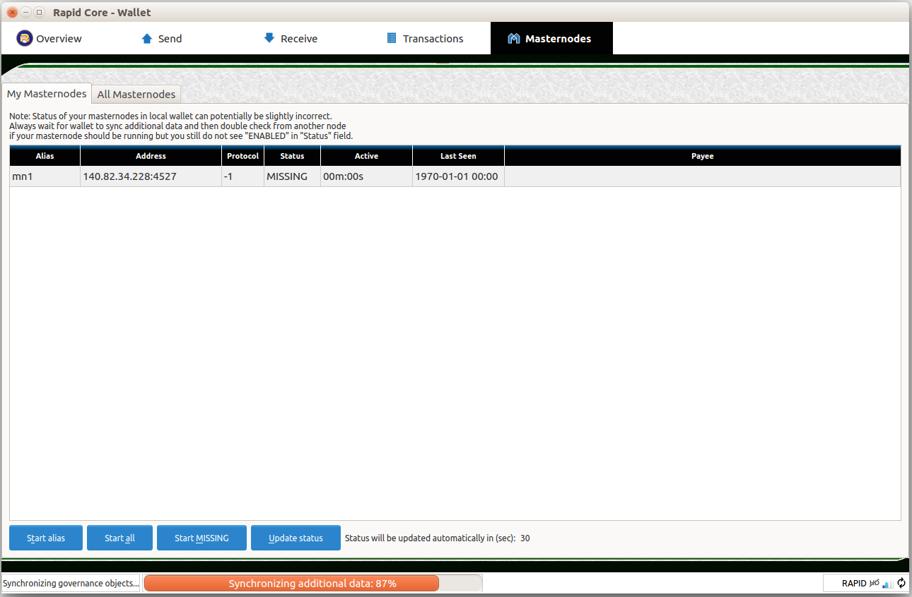</a>
<a href="Images/13.png">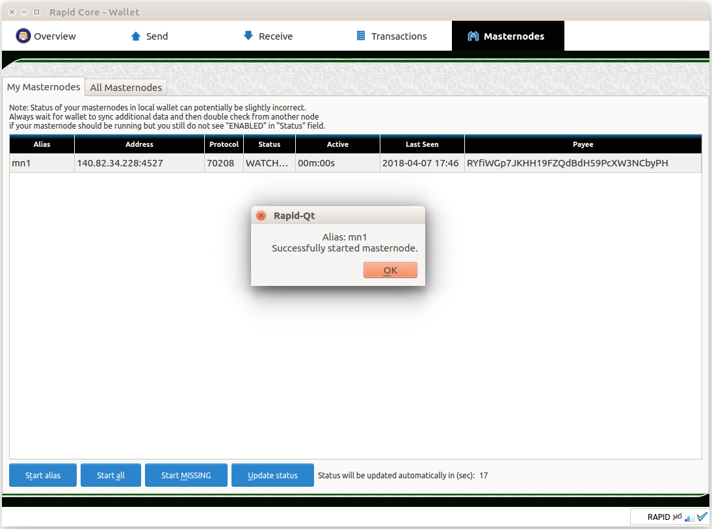</a>

We can see the output change in the masternode status fields from `Watchdog-Expired` to `Pre-Enabled` and then `Enabled` after aprox. 15 minutes. If status take longer for pass to enable, restart cold wallet and wait to get a fresh MN info sync. 

<a href="Images/14.png">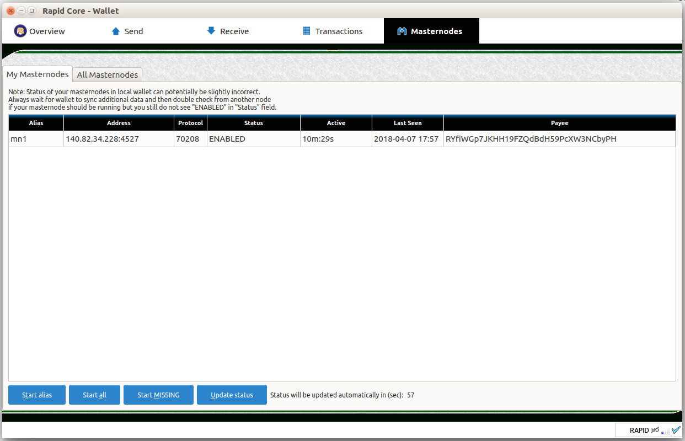</a>

Verify the status on your hot node with the command:

	rapid-cli masternode status
	{
	  "outpoint": "c93603b9a7760501a0de0d6b569adcef15e9bf888c98f93b6994559936749a02-1",
	  "service": "140.82.34.228:4527",
	  "payee": "RYfiWGp7JKHH19FZQdBdH59PcXW3NCbyPH",
	  "status": "Masternode successfully started"
	}

Well done!
Congratulations to successfully getting your masternode up and running!

------------------------------------------------------------

